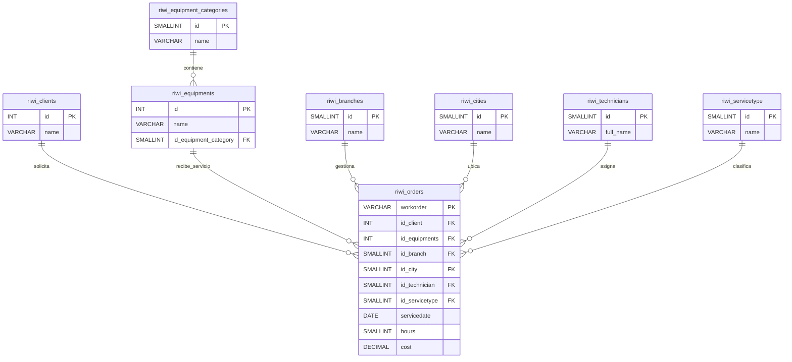

# sqlPerfonmanceTest-C5

## Project description.
In this project, you will find a detailed explanation of how the data was analyzed, cleaned, and organized, through the creation of related tables, the relational model, and the normalization process.
In this proyect i use sql how database engine.

## Explanation of the normalization process.
First, for normalization (f1), I cleaned the data by converting it to lowercase and correcting duplicate entries, ensuring that all data is standardized so there are no duplicates or redundancies (different ways of writing the same thing). Additionally, for the service type, I standardized it to “preventive” and “corrective,” since “installation” is part of “preventive” and “repair” is part of “corrective.”

For steps F2 and F3, I created the various tables, such as riwi_cities, riwi_clients, riwi_technicians, riwi_servicetype, riwi_branches, riwi_equipment_categories, riwi_equipments, and riwi_orders. This approach separates the columns that do not directly depend on the primary key of the orders table and ensures data integrity.

    • Problems Encountered.
          • Customers registered multiple times.
          • Technicians with duplicate names.
          • Equipment registered with different descriptions.
          • Duplicate services.
          • Locations with inconsistent information.
          • Cities spelled in different ways.

## Database structure.

## 👨‍💻 Author

- GitHub: **[Cristian Ronaldo Albor Parra](https://github.com/crapdev)**
- Clan: **Cumbia**
- Mail: **calborparra@gmail.com**
  
## 📄 License

This project was created for educational purposes and personal learning.
